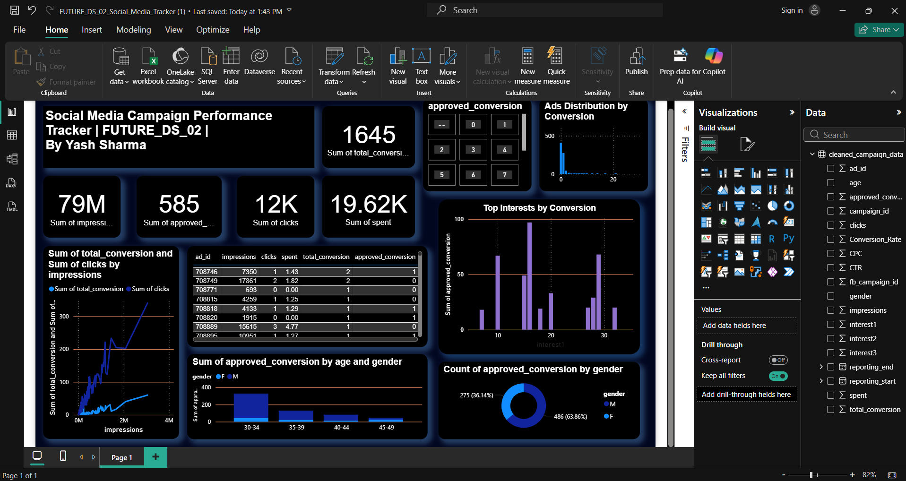

# 📊 Social Media Campaign Performance Dashboard

## 🚀 Project Overview

This project focuses on analyzing social media campaign performance using data analytics techniques. The data was cleaned and transformed using Python, and an interactive dashboard was built in Power BI to generate meaningful insights.

---

## 🛠️ Tools & Technologies

* Python (Pandas, NumPy)
* Power BI
* Excel
* GitHub

---

## ⚙️ Data Engineering & Processing

* Cleaned raw dataset using Python
* Removed inconsistencies and handled missing values
* Converted and formatted data types
* Created key performance metrics:

  * CTR (Click Through Rate)
  * CPC (Cost Per Click)
  * Conversion Rate

---

## 📈 Dashboard Features

* KPI Cards:

  * Total Impressions
  * Total Clicks
  * Total Conversions
  * Total Spend

* Interactive Visuals:

  * Conversion analysis by Age & Gender
  * Campaign performance trends
  * Interest-based conversion insights (Top N filtering applied)
  * Ads distribution based on conversions

* Filters (Slicers):

  * Campaign ID
  * Gender
  * Conversion performance

---

## 📸 Dashboard Preview

---

## 💡 Key Insights

* Identified top-performing interest segments using Top N filtering
* Analyzed gender and age group performance
* Compared campaign efficiency using CTR and Conversion Rate
* Evaluated cost efficiency using CPC and total spend

---

## 👤 Author

**Yash Sharma**

🔗 [LinkedIn](https://www.linkedin.com/in/yash-sharma-5527ab398)
🔗 [GitHub](https://github.com/hsaysh)

